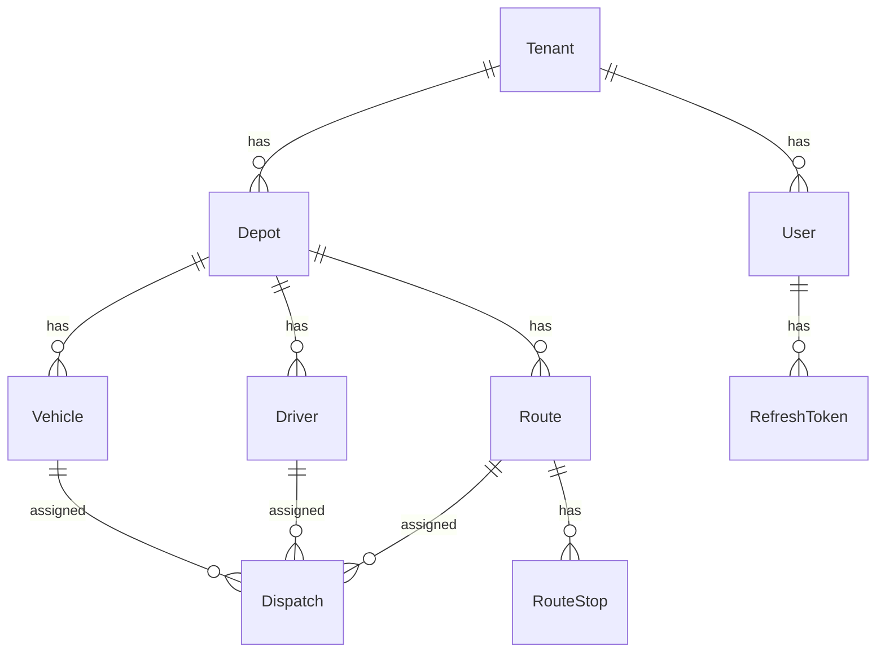
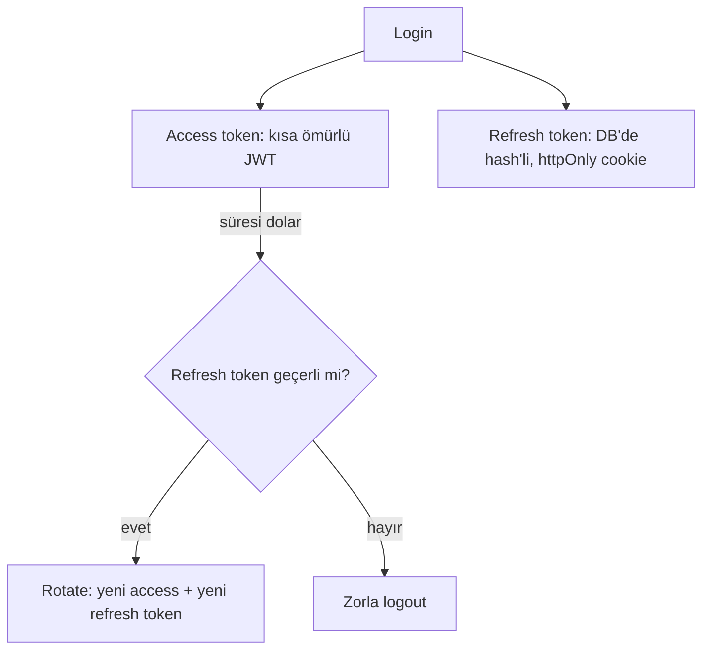

# Trekker

Multi-tenant filo ve sevkiyat yönetim platformu. Restoran/hospitality sektöründen farklı bir alanda (lojistik) modern bir SaaS ürününün uçtan uca nasıl kurulacağını göstermek amacıyla geliştirilmiş bir portfolyo projesidir.

**Canlı demo:** [trekker-gilt.vercel.app](https://trekker-gilt.vercel.app)

## Özellikler

- **Multi-tenant mimari** — her firma (Tenant) kendi depo, araç, sürücü ve rota verilerini izole bir şekilde yönetir; tüm sorgular tenant/IDOR korumalı
- **Credentials tabanlı kimlik doğrulama** — bcrypt ile parola hash'leme, self-servis kayıt akışı
- **Access + refresh token akışı** — kısa ömürlü access token, DB-backed rotate edilebilir refresh token, süresi dolan/iptal edilen tokenlarda otomatik zorla çıkış
- **Araç/Sürücü/Rota/Sevkiyat (Dispatch) CRUD işlemleri** — Server Actions + Zod validasyonu
- **Rota haritası** — react-leaflet ile durak listesi + interaktif harita, tıklanan durağa `flyTo` ile odaklanma
- **Sevkiyat tablosu** — AG Grid (Theming API) ile filtrelenebilir/sıralanabilir veri tablosu
- **Hata izleme** — Sentry entegrasyonu (client/server/edge)

## Mimari

### Veri modeli



### Auth akışı



## Tech Stack

- **Framework:** Next.js 15 (App Router), TypeScript (strict)
- **Veritabanı:** PostgreSQL (Neon) + Prisma ORM
- **Auth:** Auth.js v5 (Credentials provider + bcrypt), özel refresh token akışı
- **UI:** Tailwind CSS, AG Grid Community (v33+ Theming API), react-leaflet
- **Validasyon:** Zod
- **İzleme:** Sentry
- **CI/CD:** GitHub Actions, Husky pre-commit hooks
- **Deploy:** Vercel

## Kurulum

```bash
git clone https://github.com/dogukanacet/trekker.git
cd trekker
npm install
```

`.env` dosyasını oluştur (`.env.example`'ı referans al) ve şu değişkenleri doldur:

Veritabanını hazırla ve test kullanıcısı oluştur:

```bash
npx prisma migrate dev
npm run seed
```

Geliştirme sunucusunu başlat:

```bash
npm run dev
```
